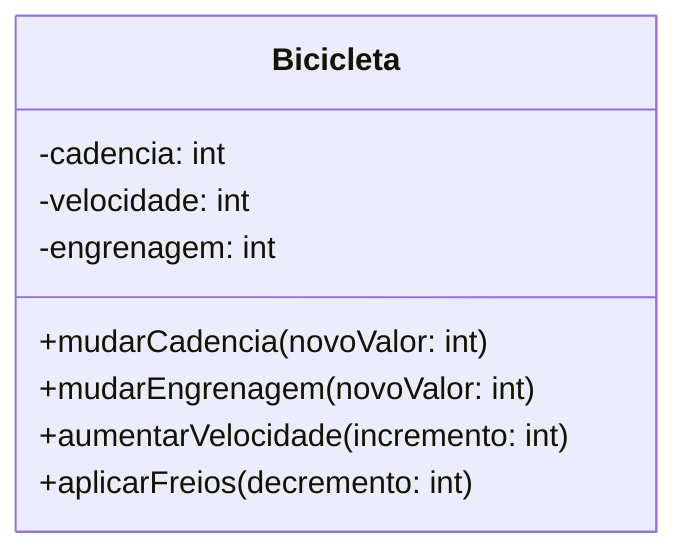

# DIO - Trilha POO Java
<div style="display:inline-block">
        <picture  title="Java">
                <source height="40" width="40" media="(prefers-color-scheme: light)" srcset="https://cdn.simpleicons.org/openjdk/000000">
                
        </picture>
        <picture  title="Apache Maven">
                <source height="40" width="40" media="(prefers-color-scheme: light)" srcset="https://cdn.simpleicons.org/apachemaven/000000">
                
        </picture>
        <picture  title="Spring Boot">
                <source height="40" width="40" media="(prefers-color-scheme: light)" srcset="https://cdn.simpleicons.org/springboot/000000">
                
        </picture>
        <picture  title="UML">
                <source height="40" width="40" media="(prefers-color-scheme: light)" srcset="https://cdn.simpleicons.org/uml/000000">
                
        </picture>
	<picture  title="Mermaid">
                <source height="40" width="40" media="(prefers-color-scheme: light)" srcset="https://cdn.simpleicons.org/mermaid/000000">
                
        </picture>
</div>

## Autora do Desafio e Repositório Original
- [Camila Cavalcante](https://github.com/cami-la)
- [Desafio POO](https://github.com/cami-la/desafio-poo-dio)

## Desafio de Projeto
Siga os passos a seguir e como desafio, implemente as evoluções que achar interessantes.

1. Abstraia o domínio Bootcamp e modele seus atributos e métodos;
2. Crie as classes: `Bootcamp`, `Cursos`, `Mentorias` e `Devs` e as relacione;
3. Modele as classes criadas, ou seja, crie seus atributos e métodos;
4. Para que o código fique mais legível e de fácil manutenção, utilize de algumas das ferramentas que o Paradigma de Orientação a Objetos (POO) nos oferece: `Abstração`, `Encapsulamento`, `Herança` e `Polimorfismo`;
5. E para representar classes que foram criadas e relacionadas, transforme-as em objetos.

## Conceitos Fundamentais
### Domínio
`Domínio` se refere à área temática ou escopo de problema que o sistema de software está sendo construído para abordar. Além de englobar os conceitos, regras e processos do mundo real que o software se propõe a modelar. Por exemplo, uma aplicação que tem como propósito representar os conceitos e comportamentos associados a uma bicicleta, o domínio (também conhecido como `camada de negócios` ou `camada de objetos de negócio`) pode incluir uma classe Bicicleta com propriedades como cadência, velocidade e engrenagem, além de métodos que representem ações como mudar cadência, mudar engrenagem, aumentar velocidade e aplicar freios como demonstra o diagrama a seguir.


### Classe
`Classe` é como um molde ou uma planta que define o `tipo` dos objetos que são criados a partir dela. No mundo real frequentemente encontramos diversos objetos individuais que são do mesmo tipo. Por exemplo, podem existir milhares de bicicletas, todas da mesma marca e modelo, sendo que cada uma delas foi construída a partir do mesmo conjunto de especificações e desenhos técnicos e portanto, contêm os mesmos componentes. Em termos orientados a objetos, podemos dizer que todas essas bicicletas são `instâncias` da classe de `objetos` conhecidos como bicicletas.
```java
public class Bicicleta {
	private int cadencia = 0;
	private int velocidade = 0;
	private int engrenagem = 1;

	public void mudarCadencia(int novoValor) {
		cadencia = novoValor;
	}

	public void mudarEngrenagem(int novoValor) {
		engrenagem = novoValor;
	}

	public void aumentarVelocidade(int incremento) {
		velocidade = velocidade + incremento;   
	}

	public void aplicarFreios(int decremento) {
		velocidade = velocidade - decremento;
	}
}
```

### Objeto
`Objetos` no mundo real compartilham duas características: estado e comportamento. Bicicletas possuem estado (cadência, velocidade, engrenagem) e comportamento (mudar cadência, mudar engrenagem, aumentar velocidade e aplicar freios). Objetos de software são conceitualmente similares a objetos do mundo real: eles também possuem estado e comportamento. Um objeto armazena seu estado em campos (também chamados de `atributos` ou propriedades) e expõe seu comportamento por meio de `métodos`.

```java
Bicicleta bicicleta = new Bicicleta();
```

### Instância
`Instância` é uma cópia executável de uma classe. Outro nome para instância é objeto.
```java
Bicicleta bicicleta = new Bicicleta();
bicicleta.aumentarVelocidade(15);
```

### Atributo
`Atributos` são variáveis dentro de uma classe que definem o `estado` da mesma.
```java
public class Bicicleta {
	private int cadencia = 0;
  	private int velocidade = 0;
  	private int engrenagem = 1;
}
```

### Variáveis
`Variáveis` são "locais" reservados na memória para armazenar um determinado tipo de dado. Existem quatro tipos de variáveis: variáveis de instância (campos não estáticos), variáveis de classe (campos estáticos), variáveis locais e parâmetros.
```java
int engrenagem = 1;
```

### Método
`Métodos` são blocos de código que apenas são executados quando chamados. Podem receber dados por meio de parâmetros e `definem o comportamento` da classe e dos objetos criados a partir dela.
```java
void mudarCadencia(int novoValor) {
  	cadencia = novoValor;
}
```
## Referências
- Domain-Driven Design (DDD) - https://www.geeksforgeeks.org/domain-driven-design-ddd/
- What Is a Class? - https://docs.oracle.com/javase/tutorial/java/concepts/class.html
- What Is an Object? - https://docs.oracle.com/javase/tutorial/java/concepts/object.html
- Object-Oriented Programming - https://www.oracle.com/java/technologies/oop.html
- Variables - https://docs.oracle.com/javase/tutorial/java/nutsandbolts/variables.html
- Declaring Classes - https://docs.oracle.com/javase/tutorial/java/javaOO/classdecl.html